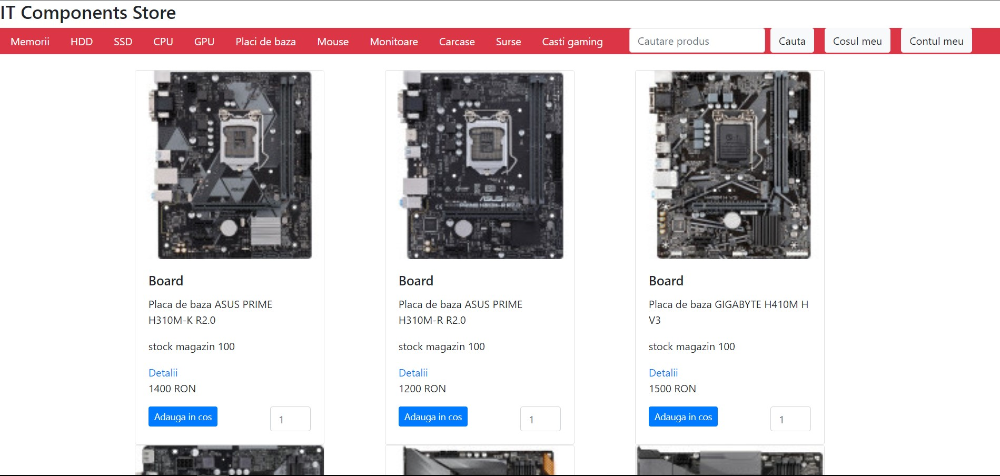
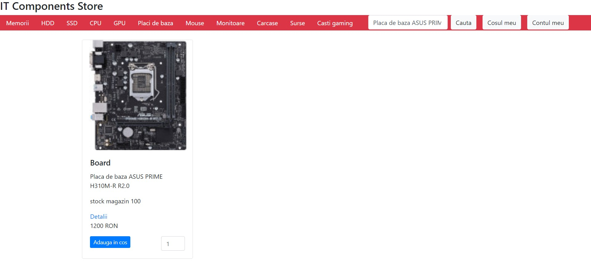
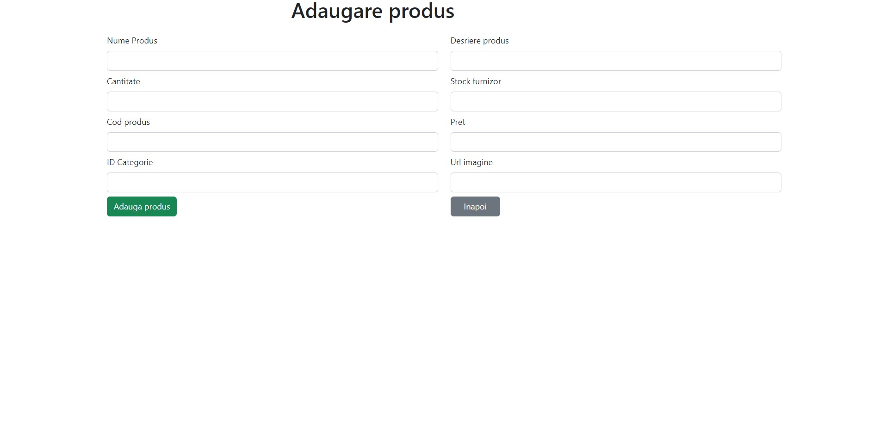
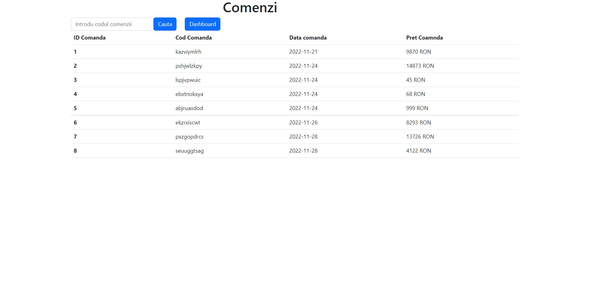

# IT Components Store
# IT Components Store Project

### About the project:

The **IT Components Store**  represents a site with an interface for users where they can purchase IT components (CPU, monitors, graphics cards and many other products) The project also has a separate page for administrators, where they can manage the products and see the orders made by users.

### Technology stack:

* **Programming languages & technologies**: Java, Spring Core, Spring Boot, JUnit
* **IDEs (Integrated Development Environment)**: IntelliJ
* **Databases/Data access providers**: PostgreSQL
* **Build automation tools**: Maven
* **Versioning systems**: Git
* **Web servers**: Tomcat
* **Spring security**

### Spring modules used:

This project is a simple Spring Boot web application that came into existence after learning and delving into several Spring Boot basic functionalities including:

* **Spring Application Context** - beans management inside the IoC (inversion of control) container
* **Spring Boot Web App** - usage of the MVC (Model-View-Controller) architectural design and Thymeleaf as a template engine
* **Spring Boot REST Services** - provide fronted-backend separation by providing JSON formatted responses to the user's HTTP requests
* **Spring Data Access** - provide data storage using Spring Data JPA (Java Persistence API) and Hibernate framework as an ORM (Object Relational Mapping) implementation
* **Spring Testing** - provide unit tests for increased project flow maintainability
* **Spring security**-Spring Security is a powerful and highly customizable authentication and access-control framework

### How to use Java Backend Locally:

For every software installed, add the binary folder to the system environment variables, then open the command line and check if the installation was successful by checking the version.

1. Install and configure JDK (Java Development
   Kit) [https://www.oracle.com/java/technologies/javase/jdk18-archive-downloads.html](https://www.oracle.com/java/technologies/javase/jdk18-archive-downloads.html).

```bash
java --version
```

2. Install and configure Maven [https://maven.apache.org/download.cgi](https://maven.apache.org/download.cgi).

```bash
mvn --version
```

3. Install and configure PostgreSQL [https://www.postgresql.org/download/](https://www.postgresql.org/download/).


4. To clone the project in your local repository, copy the '.git' link inside the code section of the GitHub repository and choose HTTPS as the cloning method. In the command line type:

```bash
git clone https://github.com/GabrielStanciulescu/ITComponentsStore.git
```

5. Install an IDE (Integrated Development Environment) that supports Java to run the application (IntelliJ is
   preferred): [https://www.jetbrains.com/idea/download/?fromIDE=#section=windows](https://www.jetbrains.com/idea/download/?fromIDE=#section=windows)


6. Inside the src/main/resources/application.properties file modify the username and password with the credentials set in the installation wizard:

```properties
spring.datasource.username=postgres
spring.datasource.password=[insert_your_password]
```

7. Execute the application by running the main() method inside src/main/java/com/it_components_store/ItComponentsStoreApplication.java or by executing de terminal command: `./mvnw clean spring-boot:run`
   . This should activate the Tomcat Container and provide access to http://localhost:8090 and create the tables needed inside the database.

8. Inside the src/main/resources/application.properties  Modify the following for sending mail

```properties
spring.mail.host=
spring.mail.port=server_port
spring.mail.username=insert_username
spring.mail.password=insert_password
spring.mail.properties.mail.smtp.auth=true
spring.mail.properties.mail.smtp.starttls.enable=true

```


### Web Application Flows:
* **Registration Page**: Here, the user has to input the provided fields to create an account. Their credentials are saved in the database and can be accessed for later use.


* **Login Page**: Here, the user has to input the credentials of an existing account. By doing that, they will be redirected to the home page and have access to the secured endpoints available
  for his role


* **Forgot Password**:Here, the user can recover the password


* **Reset Password**
  


* **Home Page**: Here, the user can add the products to the shopping cart
  

* **Search Bar**: The search bar makes it easier to find the product


* **Shopping Cart**: 
* 

* **Order Details**:
* 

* **Dashboard**: When the user has the role of administrator, he will be redirected to the dashboard, depending on the role, he will be able to modify, add and delete products from the database
* 

* **Add Product from Dashboard**:
* 

* **Modify Product from Dashboard**:
* 

* **Order Page**:
* 

* **Order details **:
* 


